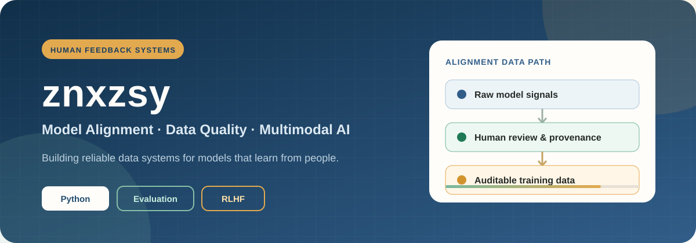

  

   

  
  
  

我在做模型效果背后的那段工程：把可验证仿真、人类反馈、质量复核和模型评测接成真正能迭代的数据系统。

最近公开了两个相互补充的项目。**VeriInk** 针对模型薄弱点生产可复现的合成数据；**AlignLedger** 负责多人标注、二次复核、责任追踪和训练前导出。一个解决数据从哪里来，一个解决数据如何可信地留下来。

## Selected work

<table>
  <tr>
    <td width="50%" valign="top">
      <h3><a href="https://github.com/znxzsy/VeriInk">VeriInk</a></h3>
      
可验证的手写仿真 Agent。生成带标签、seed、边界检查与哈希的合成场景，把失败样本送回下一轮数据生产。

      
<code>Synthetic Data</code> <code>Multimodal</code> <code>Post-training</code> <code>Evaluation</code>

    </td>
    <td width="50%" valign="top">
      <h3><a href="https://github.com/znxzsy/AlignLedger">AlignLedger</a></h3>
      
面向强化学习与大模型训练的人类反馈平台，支持多人标注、二次复核、实名追踪、质量榜单和可审计导出。

      
<code>RLHF</code> <code>DPO</code> <code>KTO</code> <code>Human Feedback</code>

    </td>
  </tr>
</table>

## Current focus

- 为后训练与基座模型持续生产可验证数据，并用回归结果推动下一轮生成。
- 多模态教育 Agent、智能批改与真实任务评测。
- 人类反馈数据的清洗、复核、归因和训练前质量控制。
- 多智能体对抗测试与安全评估：[poi-agent](https://github.com/znxzsy/poi-agent)。

## Tools I use

  
  
  
  
  

如果你在做模型后训练、可验证数据生产、私有化部署或多模态评测，欢迎联系微信 **`znxzsy`**。具体问题也可以直接在对应项目开 Issue。
